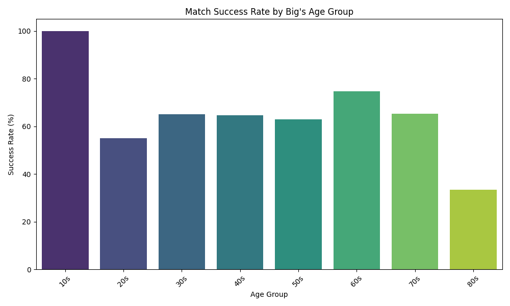
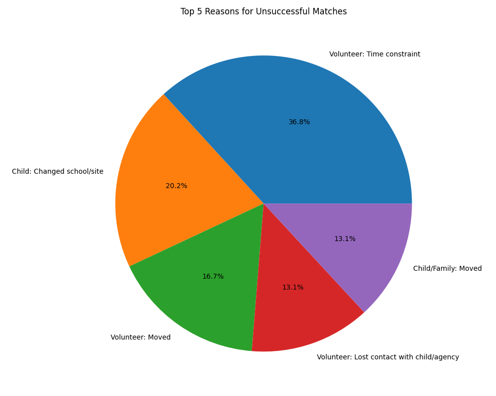
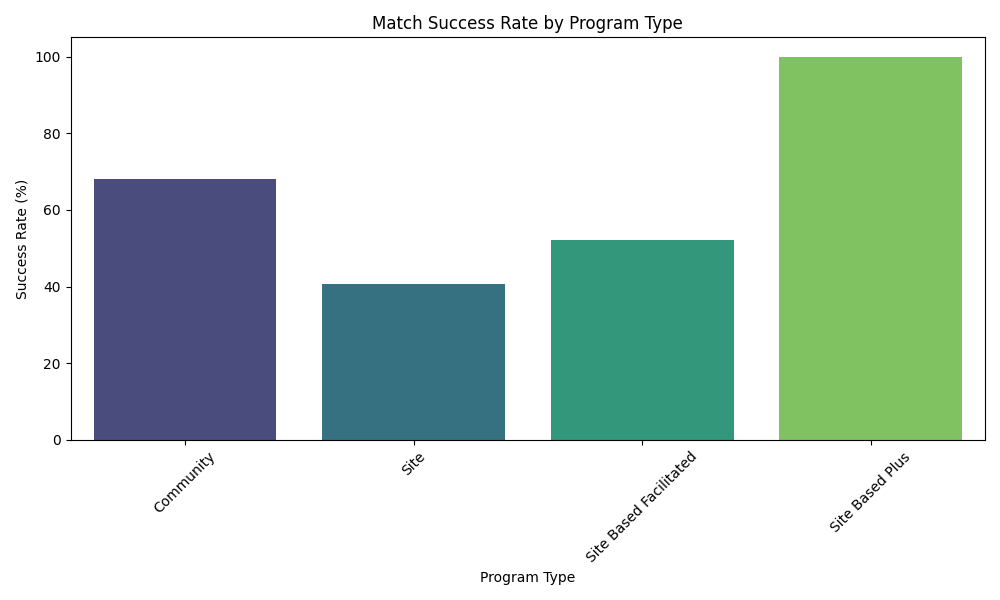

# Response Variables of Interest  
- **Match Length**  
- **Closure Reason**  

## Understanding the Response Variable Distributions  

### Match Length  
- Most matches tend to be on the shorter side, peaking at around **18 months**.  

### Closure Reasons  
- A significant portion of closures are due to **relocation**—whether the Little moves homes, changes schools, or leaves the agency.  
- Other common reasons include:  
  - **COVID-related closures**  
  - **Loss of contact** between the Big and Little  
  - **Successful match closures**  

---

## Variation of Response Variables Across Program Types  

### Match Length by Program Type  
- Some program types tend to have longer match durations than others.  
- **Structured mentorship programs** often have longer-lasting matches compared to informal programs.  

### Closure Reasons by Program Type  
- Certain closure reasons are more prevalent in specific programs:  
  - Some programs have a higher rate of **voluntary closures**, where either the Big or Little ends the match.  
  - Others experience more **administrative closures**, often due to relocation or program requirements.  

---

## Changes in Response Variable Distributions Over Time  

- **Match Length Over Time:**  
  - There has been a noticeable decline in match length, meaning matches tend to end earlier than in previous years.  

- **Closure Reasons Over Time:**  
  - All closure categories have been decreasing in duration, indicating that matches are closing sooner across the board.  

---

## Demographic Influence on Response Variables  

- **Primary Closure Reason:** The most common reason for closure is **relocation**, as the Big and Little move away from each other or from the agency.  
- **Gender and Match Success:** Matches where the Big and Little share the **same gender** tend to have a lower closure rate.  

---

## Impact of Demographic and Interest Alignment on Match Success  

- **Gender Alignment & Match Length:**  
  - Same-gender matches tend to last longer, although there is variability across groups.  

- **Interest Alignment & Match Length:**  
  - Matches with **at least one shared interest** tend to last longer, reinforcing the idea that common hobbies strengthen relationships.  

---

## Insights for Big Brothers Big Sisters Twin Cities  

### Factors Leading to a Successful Match  

- **Recruit Older Volunteers:**  
  - Volunteers in their **60s and 70s** show the highest success rates, likely due to greater stability and availability.  

- **Prioritize Same-Gender Matches:**  
  - Same-gender matches have a **9% higher success rate** than cross-gender matches.  

- **Enhance Site-Based Programs:**  
  - Community-based programs **outperform site-based programs**. Consider evaluating and improving the structure of site-based programs to increase success rates.

Median match length: 16.8
Successful matches: 2028
Unsuccessful matches: 1247
Success rate: 61.92%

Success rate by Big's age group:
               count  sum  success_rate
Big Age Group                          
10s                1    1    100.000000
60s              130   97     74.615385
70s               23   15     65.217391
30s             1395  909     65.161290
40s              374  242     64.705882
50s              259  163     62.934363
20s             1090  600     55.045872
80s                3    1     33.333333

Success rate by gender match:
             count   sum  success_rate
same_gender                           
False          201   108     53.731343
True          3074  1920     62.459336

Success rate by common interest categories:
                count   sum  success_rate
...
Volunteer: Moved                              8.179631
Volunteer: Lost contact with child/agency     6.415397
Child/Family: Moved                           6.415397
